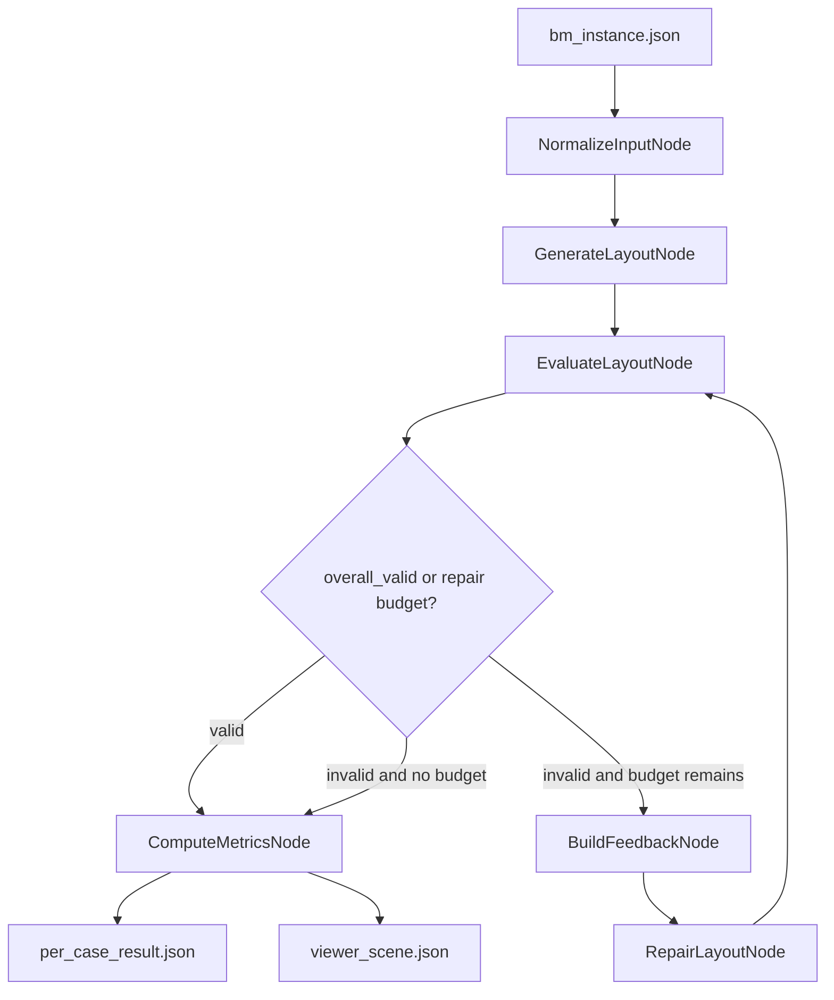
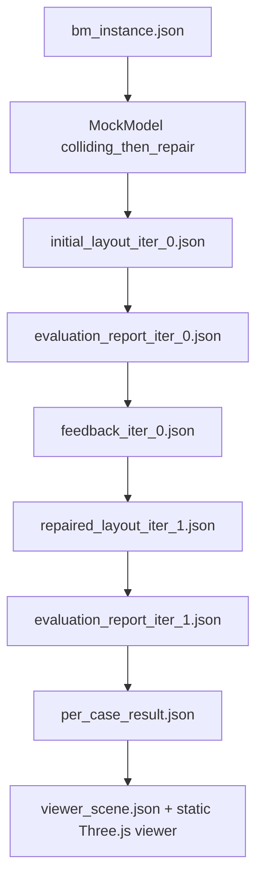

# Repo Architecture Audit

Audit date: 2026-05-21

Repository root inspected:
`C:\Users\32394\OneDrive\Desktop\3D benchmarking\3d_layout_benchmark`

## 1. Executive Summary

The repository is runnable in the inspected Windows environment when using the `py` launcher. The `python` command itself is not available because the Windows Store alias is active, so the requested commands were executed with `py`.

The repository implements the benchmark core:

- bbox-based model-facing `layout.json`
- deterministic Python evaluator for schema, physical, and spatial relation validity
- deterministic `feedback.json` builder
- LangGraph workflow with repair routing
- mock model for no-API local runs
- metrics and aggregation
- minimal Three.js visualization/demo

The optional repair loop is implemented and works with `MockModel(behavior="colliding_then_repair")`. The default mock behavior is `valid`, so a command with `--max_repair_iterations 1` but no mock behavior override usually exits after the first valid evaluation and does not exercise repair.

Visualization/demo is implemented as auxiliary tooling. `scripts/run_demo.py` manually runs an intentionally invalid initial layout, deterministic feedback, one repair, final evaluation, and writes a `viewer_scene.json` plus static Three.js files.

Biggest blockers:

- No P0 blocker for the mock-based MVP. One-shot benchmark, repair smoke path, folder benchmark, validation, demo generation, and tests all pass.

Biggest inconsistencies / risks:

- `python` command is unavailable in this Windows environment; use `py`.
- Provider entries in `configs/model_config.yaml` are scaffolds. Real OpenAI-compatible / Anthropic-compatible / Gemini-compatible / vLLM construction is not implemented. `LangChainModel` requires a pre-built Runnable object.
- Normal workflow history stores paths and booleans only. The viewer adapter only builds rich per-iteration scenes when history entries embed `layout` and `evaluation`, which `scripts/run_demo.py` does but the core LangGraph nodes do not.
- `benchmark_config.yaml` contains `save_intermediate_artifacts` and `outputs.per_case_filename`, but workflow code always saves artifacts and hardcodes `per_case_result.json`.
- `scripts/run_single_case.py` writes `initial_layout.json`, while `scripts/run_demo.py` writes `initial_layout_iter_0.json`.

## 2. High-Level Pipeline

Actual implemented pipeline for normal CLI benchmark:



Implemented demo pipeline:



The demo runner does not call the LangGraph graph. It manually invokes the same model, evaluator, feedback, metrics, and visualization functions to make the workflow artifacts explicit.

## 3. Repository Structure

Concise source tree, excluding generated `outputs/` content:

```text
3d_layout_benchmark/
  README.md                       # project overview and run commands
  pyproject.toml                  # package metadata and dependencies
  benchmark_notes.txt             # current notes / questions / workflow

  configs/
    benchmark_config.yaml         # artifact/viewer/default repair settings
    evaluator_config.yaml         # geometry and spatial thresholds
    model_config.yaml             # mock and placeholder provider configs

  schemas/
    bm_instance.schema.json       # benchmark input contract
    layout.schema.json            # bbox layout contract
    evaluation_report.schema.json # deterministic evaluator output contract
    feedback.schema.json          # deterministic feedback output contract

  data/
    benchmark_cases/
      bm_instance_001.json        # bedroom case
      bm_instance_002.json        # living room case

  outputs/
    .gitkeep                      # output directory placeholder

  scripts/
    run_single_case.py            # one case CLI
    run_benchmark.py              # case folder CLI
    validate_case.py              # bm_instance schema validator
    run_demo.py                   # visual smoke demo artifact generator/server option

  src/
    benchmark/
      data/
        load_cases.py             # load/iterate benchmark cases
      evaluator/
        evaluator.py              # LayoutEvaluator orchestration
        schema_check.py           # JSON/schema/manual layout checks
        geometry.py               # bbox/footprint geometry helpers
        physical_check.py         # boundary/z/collision/support checks
        spatial_check.py          # relation and required-object checks
      feedback/
        feedback_builder.py       # deterministic report -> feedback transform
      metrics/
        metrics.py                # per-case metrics from history
        aggregate.py              # benchmark-level aggregation and CSV/JSON outputs
      models/
        base_model.py             # abstract model interface and prompts
        mock_model.py             # deterministic mock generation/repair
        langchain_model.py        # Runnable-based LangChain adapter
        factory.py                # provider name -> model adapter
      utils/
        io.py                     # JSON/YAML IO helpers
        logging.py                # logging setup helper
      visualization/
        threejs_adapter.py        # viewer_scene.json adapter
      visual_judge/
        render_views.py           # placeholder, not implemented
        vlm_judge.py              # placeholder, not implemented
      workflow/
        state.py                  # BenchmarkState TypedDict
        nodes.py                  # workflow node implementations
        graph.py                  # LangGraph definition and fallback runner

  tests/
    test_schema_validation.py
    test_geometry.py
    test_evaluator.py
    test_feedback_builder.py
    test_metrics.py
    test_graph.py

  web/
    viewer/
      index.html                  # static viewer shell
      viewer.js                   # Three.js viewer logic
      style.css                   # viewer layout/styling
```

Repository metadata note: `git status --short` failed with `fatal: not a git repository`, so this audit treats the directory as a filesystem project rather than a Git checkout.

## 4. Data Contracts

### Benchmark instance / input format

Implemented in:

- `schemas/bm_instance.schema.json`
- examples in `data/benchmark_cases/bm_instance_001.json`
- examples in `data/benchmark_cases/bm_instance_002.json`
- loader in `src/benchmark/data/load_cases.py`
- CLI use in `scripts/run_single_case.py`, `scripts/run_benchmark.py`, `scripts/validate_case.py`

Actual format:

- `task_id`: required string
- `input_mode`: required enum: `text_only`, `text_room_boundary`, `text_room_boundary_objects`
- `scene_prompt`: required string
- `room`: optional at schema top level, but if present requires `unit`, `floor_polygon`, `floor_z`, `wall_height`
- `required_objects`: optional, may be `null` or unique string array
- `spatial_constraints`: optional array
- `hidden_annotations`: optional object

Status: implemented, mostly aligned.

Notes:

- The schema does not conditionally require `room` for `text_room_boundary` / `text_room_boundary_objects`, nor require `required_objects` for `text_room_boundary_objects`. This is acceptable for MVP flexibility but is not strict level enforcement.
- Input format does not require images. This matches the current benchmark design.
- `hidden_annotations` is not required. This matches the MVP requirement.

### Layout format

Implemented in:

- `schemas/layout.schema.json`
- `src/benchmark/models/mock_model.py`
- `src/benchmark/models/base_model.py`
- `src/benchmark/evaluator/schema_check.py`
- `src/benchmark/visualization/threejs_adapter.py`

Actual model-facing layout is bbox-based:

- top-level `scene_id`, `unit`, `coordinate_system`, `objects`
- object fields: `object_id`, `category`, `center`, `size`, `yaw`
- optional object fields: `support_parent`, `region_id`
- optional top-level `relations`
- optional top-level `hierarchy`

Status: implemented.

Notes:

- `layout.schema.json` requires `object_id`, `category`, `center`, `size`, `yaw`; it does not require `support_parent`.
- `MockModel` always emits `support_parent: "floor"` and `region_id`.
- No evaluator validity fields are stored in layout JSON.
- No NeRF, 3D Gaussian Splatting, point cloud, voxel, mesh, or diffusion representation was found in the core layout contract.

### Evaluation report format

Implemented in:

- `schemas/evaluation_report.schema.json`
- `src/benchmark/evaluator/evaluator.py`
- generated examples in `outputs/debug_case*/evaluation_report_iter_*.json`

Actual keys:

- `task_id`
- `iteration`
- `overall_valid`
- `summary.schema_valid`
- `summary.physical_valid`
- `summary.spatial_relation_valid`
- `summary.num_schema_errors`
- `summary.num_physical_errors`
- `summary.num_spatial_relation_errors`
- `schema_failures`
- `physical_failures`
- `spatial_relation_failures`
- `repair_targets`
- extra allowed field: `physical_diagnostics`

Status: implemented and consistent with downstream metrics/feedback.

Notes:

- `physical_diagnostics` is not required by the schema but allowed by `additionalProperties: true`.
- If schema validation fails, physical and spatial checks are skipped and their validity booleans remain `false` with zero physical/spatial failures. This is deterministic and simple, but it means downstream consumers should interpret physical/spatial validity as blocked by invalid schema.

### Feedback format

Implemented in:

- `schemas/feedback.schema.json`
- `src/benchmark/feedback/feedback_builder.py`
- generated examples in `outputs/debug_case_repair/feedback_iter_0.json` and `outputs/demo/feedback_iter_0.json`

Actual keys:

- `task_id`
- `iteration`
- `repair_targets`
- `locked_objects`
- `violations`
- `instruction`

Status: implemented.

Notes:

- Feedback categories are `schema`, `physical`, and `spatial_relation`.
- Feedback is fully deterministic from evaluator failures and current layout object IDs.
- No LLM call is used to build feedback.

### Viewer scene format

Implemented in:

- `src/benchmark/visualization/threejs_adapter.py`
- enriched further by `scripts/run_demo.py`
- consumed by `web/viewer/viewer.js`

Actual top-level fields include:

- `task_id`
- `iteration`
- `overall_valid`
- `summary`
- `room`
- `objects`
- `relations`
- `violations`
- `history`
- `metadata`
- `coordinate_conversion`
- `iterations`

Demo-specific additions:

- `workflow.artifacts`
- `feedback`
- `metrics`

Status: implemented for current/final scene; partially implemented for generic multi-iteration history.

Important caveat:

- `threejs_adapter._iteration_scenes()` only emits per-iteration scenes when each history item contains embedded `layout` and `evaluation` dictionaries.
- The core LangGraph `EvaluateLayoutNode` history stores paths and validity booleans only, not embedded layout/evaluation.
- Therefore normal `run_single_case.py` repair output has a final viewer scene and compact history, while `run_demo.py` has rich before/after interactive scenes.

## 5. Workflow / LangGraph

Component:
Workflow graph

Implemented in:

- `src/benchmark/workflow/state.py`
- `src/benchmark/workflow/nodes.py`
- `src/benchmark/workflow/graph.py`

Role:
Runs generation, deterministic evaluation, optional deterministic feedback, repair, and metrics.

State:
`BenchmarkState` includes `task_id`, `model_name`, `model`, `case_path`, `out_dir`, `input_json`, `layout_schema`, `evaluator_config`, `benchmark_config`, `current_layout`, `current_evaluation`, `current_feedback`, `iteration`, `max_repair_iterations`, `history`, `evaluation_reports`, `metrics`, and `per_case_result`.

Nodes:

| Node | Implemented? | File | Input | Output | Role |
|---|---:|---|---|---|---|
| `NormalizeInputNode` | Yes | `src/benchmark/workflow/nodes.py` | case path or `input_json`, schema path or schema | normalized state | loads input/schema, initializes history/evaluation reports |
| `GenerateLayoutNode` | Yes | `src/benchmark/workflow/nodes.py` | state model, input JSON, layout schema | `initial_layout.json`, `current_layout` | calls target model once |
| `EvaluateLayoutNode` | Yes | `src/benchmark/workflow/nodes.py` | input JSON, current layout | `evaluation_report_iter_N.json`, history entry | calls deterministic evaluator |
| `BuildFeedbackNode` | Yes | `src/benchmark/workflow/nodes.py` | current evaluation/layout/input | `feedback_iter_N.json` | deterministic feedback |
| `RepairLayoutNode` | Yes | `src/benchmark/workflow/nodes.py` | input/layout/feedback/schema/model | `repaired_layout_iter_N.json` | calls same model object by default |
| `ComputeMetricsNode` | Yes | `src/benchmark/workflow/nodes.py` | history/current evaluation | `per_case_result.json`, optional `viewer_scene.json` | computes metrics and viewer export |
| `route_after_eval` | Yes | `src/benchmark/workflow/nodes.py` | current evaluation, iteration, max budget | `"repair"` or `"metrics"` | controls stop/repair |

Graph definition:

- `src/benchmark/workflow/graph.py::build_graph()`
- Uses `langgraph.graph.StateGraph` if installed.
- Falls back to `SequentialBenchmarkGraph` if LangGraph import fails.

Routing:

- `START -> normalize_input -> generate_layout -> evaluate_layout`
- `evaluate_layout -> compute_metrics` if valid
- `evaluate_layout -> compute_metrics` if invalid and budget exhausted
- `evaluate_layout -> build_feedback -> repair_layout -> evaluate_layout` if invalid and repair budget remains
- `compute_metrics -> END`

Status: implemented and matches the expected conceptual graph.

History:

- Every `EvaluateLayoutNode` appends one history entry with iteration, layout path, evaluation path, validity booleans, and error counts.
- Normal history does not embed layout/evaluation content.

## 6. LangChain / Model Interface

Component:
Model abstraction

Implemented in:

- `src/benchmark/models/base_model.py`
- `src/benchmark/models/langchain_model.py`
- `src/benchmark/models/mock_model.py`
- `src/benchmark/models/factory.py`

Role:
Defines target model interface for generation and repair.

Interface:

- `BaseLayoutModel.generate_layout(bm_instance, layout_schema) -> dict`
- `BaseLayoutModel.repair_layout(bm_instance, current_layout, feedback, layout_schema) -> dict`

Prompt helpers:

- `build_generation_prompt()`
- `build_repair_prompt()`

LangChain usage:

- `LangChainModel` accepts any Runnable-compatible object as `runnable`.
- Calls `runnable.invoke(prompt)`.
- Converts the response to text using `_response_to_text()`.
- Parses a JSON object using `parse_json_object()`.

Status: partial.

Implemented:

- Generic Runnable wrapper.
- JSON extraction/parsing from model response text.
- No proprietary provider hardcoding in code.

Not implemented:

- Construction of OpenAI-compatible / Anthropic-compatible / Gemini-compatible / vLLM clients from config.
- API key loading.
- Provider-specific structured output mode.
- Automatic jsonschema validation inside the model wrapper.

Important behavior:

- Model output is evaluated later by `EvaluateLayoutNode`, so invalid layout JSON becomes deterministic schema failures.
- If a non-mock provider is selected from the current YAML config without injecting a Runnable, `LangChainModel` raises `RuntimeError("LangChainModel requires a Runnable-compatible model instance.")`.

## 7. Backbone VLM / LLM

Configuration file:

- `configs/model_config.yaml`

Supported provider names in config:

- `mock`
- `openai_compatible`
- `anthropic_compatible`
- `gemini_compatible`
- `vllm`

Actual operational provider:

- `mock`

Factory:

- `src/benchmark/models/factory.py::create_model()`

Same-model repair:

- Implemented by state object reuse. `GenerateLayoutNode` and `RepairLayoutNode` both call `state["model"]`.
- No separate repair model is selected by default.

Status:

- Mock model: implemented.
- Real model providers: planned scaffold only / not implemented.

API key handling:

- `api_key_env` values exist in YAML.
- No code currently reads those environment variables or builds provider clients.

## 8. Evaluator

Component:
Python deterministic evaluator

Implemented in:

- `src/benchmark/evaluator/evaluator.py`
- `src/benchmark/evaluator/schema_check.py`
- `src/benchmark/evaluator/geometry.py`
- `src/benchmark/evaluator/physical_check.py`
- `src/benchmark/evaluator/spatial_check.py`

Role:
Deterministically evaluates schema, physical, and spatial relation validity.

Input:

- benchmark instance dict
- layout dict or JSON string
- iteration integer

Output:

- evaluation report dict

Called by:

- `EvaluateLayoutNode`
- `scripts/run_demo.py`
- tests

Calls:

- `check_layout_schema()`
- `check_physical_validity()`
- `check_spatial_relations()`

Determinism:

- Pure Python deterministic logic.
- Uses `jsonschema`, `numpy`, and `shapely`.
- No LLM involvement.

Evaluator checks:

| Check | Implemented? | File | Notes |
|---|---:|---|---|
| JSON parse success | Yes | `schema_check.py` | accepts dict or JSON string |
| JSON schema validation | Yes | `schema_check.py` | uses `Draft202012Validator` |
| required top-level fields | Yes | `schema_check.py`, `layout.schema.json` | `scene_id`, `unit`, `coordinate_system`, `objects` |
| unique `object_id` | Yes | `schema_check.py` | duplicate failure includes object ID |
| category string | Yes | `schema_check.py` | non-empty string |
| center length-3 numeric | Yes | `schema_check.py` | booleans rejected |
| size length-3 positive numeric | Yes | `schema_check.py` | booleans rejected |
| yaw numeric | Yes | `schema_check.py` | booleans rejected |
| unit is meter | Yes | `schema_check.py`, schema | `unit == "meter"` |
| coordinate system exists | Yes | `schema_check.py`, schema | checks `rotation_unit == "degree"` |
| z min / z max | Yes | `geometry.py::bbox_z_bounds` | center z +/- height/2 |
| room boundary | Yes | `physical_check.py`, `geometry.py` | yaw-aware footprint polygon covered by room polygon |
| wall height | Yes | `physical_check.py` | `z_max <= wall_height + tolerance` |
| below floor | Yes | `physical_check.py` | `z_min >= floor_z - tolerance` |
| object-object collision | Yes | `physical_check.py` | requires vertical overlap and footprint intersection area |
| yaw-aware footprint | Yes | `geometry.py::footprint_polygon` | default `yaw_aware=True` |
| floor support / floating | Yes | `physical_check.py` | floor z contact tolerance |
| parent support | Yes | `physical_check.py` | parent z max and horizontal overlap ratio |
| missing support parent | Yes | `physical_check.py` | deterministic failure |
| required objects | Yes | `spatial_check.py` | controlled by `spatial.check_required_objects` |
| near | Yes | `spatial_check.py` | center XY distance <= threshold |
| far | Yes | `spatial_check.py` | center XY distance >= threshold |
| facing | Yes | `spatial_check.py` | yaw-derived facing vector, angle threshold |
| against_wall | Yes | `spatial_check.py` | nearest/named wall distance threshold |
| on_top_of | Yes | `spatial_check.py` | z contact plus horizontal overlap |
| left_of/right_of | Yes | `spatial_check.py` | center x delta |
| in_front_of/behind | Yes | `spatial_check.py` | center y delta |
| reachability | Not implemented | Not found | mentioned only as future category inspiration |

Thresholds:

- `configs/evaluator_config.yaml`
- `physical_check.py` reads `geometry` section.
- `spatial_check.py` reads `spatial` section.

Hardcoded fallbacks:

- Code has fallback defaults matching the config values.
- This is acceptable for robustness, but exact benchmark values should be controlled by config for experiments.

## 9. Feedback and Repair Loop

### Feedback builder

Component:
Deterministic feedback builder

Implemented in:

- `src/benchmark/feedback/feedback_builder.py`

Input:

- `evaluation_report`
- `current_layout`
- `bm_instance`

Output:

- feedback dict matching `schemas/feedback.schema.json`

Called by:

- `BuildFeedbackNode`
- `scripts/run_demo.py`
- tests

Logic:

- Sorts `evaluation_report.repair_targets`.
- Computes `locked_objects` as all current layout object IDs not in repair targets.
- Converts `schema_failures`, `physical_failures`, and `spatial_relation_failures` into feedback `violations`.
- Preserves category names as `schema`, `physical`, `spatial_relation`.
- Emits static instruction: `Fix only the listed violations. Preserve valid objects. Return corrected layout JSON only.`

Status: implemented.

No LLM is used.

### Repair loop

Component:
Repair loop

Implemented in:

- `src/benchmark/workflow/nodes.py::RepairLayoutNode`
- `src/benchmark/workflow/nodes.py::route_after_eval`
- `src/benchmark/workflow/graph.py`

Input:

- input JSON
- current layout
- deterministic feedback
- layout schema
- same model object stored in state

Output:

- full repaired layout JSON in `repaired_layout_iter_N.json`

Status: implemented.

Stop condition:

- If `overall_valid` is true, route to metrics.
- If current `iteration < max_repair_iterations`, route to repair.
- Otherwise route to metrics.

Artifact names:

- normal workflow initial layout: `initial_layout.json`
- normal workflow evaluation: `evaluation_report_iter_N.json`
- normal workflow feedback: `feedback_iter_N.json`
- normal workflow repair: `repaired_layout_iter_N.json`
- demo initial layout: `initial_layout_iter_0.json`

Edge case:

- If the initial layout is already valid, repair does not run even when `max_repair_iterations > 0`.
- This is correct workflow behavior, but the default mock model means `--max_repair_iterations 1` alone does not smoke-test repair.

## 10. Metrics

Component:
Metrics

Implemented in:

- `src/benchmark/metrics/metrics.py`
- `src/benchmark/metrics/aggregate.py`
- `ComputeMetricsNode`
- `scripts/run_benchmark.py`

Input:

- history entries from evaluator calls
- `max_repair_iterations`

Output:

- per-case metrics dict
- `per_case_result.json`
- aggregate `per_model_summary.json`
- aggregate `per_model_summary.csv`

Core metrics implemented:

- `schema_validity`
- `physical_validity`
- `spatial_relation_validity`
- `overall_validity`
- initial category validity variants
- `num_iterations`
- `final_iteration`

Repair metrics implemented when `max_repair_iterations > 0`:

- `success_at_k`
- `schema_error_reduction`
- `physical_error_reduction`
- `spatial_relation_error_reduction`
- `final_validity_after_repair`

Aggregation:

- `aggregate_case_results()` averages metric values over cases.
- `write_summary_outputs()` writes JSON and CSV summary.

Status: implemented.

Notes:

- There is no separate leaderboard file. Not required for MVP.
- `benchmark_config.yaml.outputs.per_case_filename` is not used; per-case filename is hardcoded in `ComputeMetricsNode`.

## 11. Visualization / Three.js

### Python adapter

Component:
Viewer scene adapter

Implemented in:

- `src/benchmark/visualization/threejs_adapter.py`

Input:

- benchmark instance
- layout
- evaluation report
- optional history

Output:

- `viewer_scene.json` compatible dict

Role:

- Auxiliary visualization export only.
- Does not compute metrics.
- Does not replace the deterministic evaluator.

Coordinate conversion:

- project `[x, y, z]`
- Three.js `[x, z, y]`
- recorded in `coordinate_conversion.project_xyz_to_threejs`
- `viewer.js::project()` maps to `new THREE.Vector3(x, z, y)`

Status: implemented, with the multi-iteration caveat noted in section 4.

### Static viewer

Implemented in:

- `web/viewer/index.html`
- `web/viewer/viewer.js`
- `web/viewer/style.css`

Role:

- Load `viewer_scene.json`.
- Display bbox scene and workflow artifacts.
- Visualization only.

Implemented display features:

- room floor polygon
- room outline and wall height
- bbox objects as Three.js boxes
- object labels as sprites
- invalid object highlighting
- highlighted objects when clicking violations/feedback
- relation lines/arrows for object-to-object relations
- summary panel
- violations panel
- deterministic feedback panel
- metrics panel
- relations panel
- history panel
- workflow step bar
- JSON artifact drawer
- before/after repair controls
- replay workflow control
- OrbitControls for camera interaction

Status: implemented as MVP.

Dependencies:

- Three.js and OrbitControls from jsDelivr CDN.
- This means the viewer needs network access unless those assets are vendored later.

## 12. Demo Runner

Component:
Demo runner

Implemented in:

- `scripts/run_demo.py`

Expected behavior:

- run one demo case
- use mock model
- use one repair iteration
- intentionally generate inconsistent initial layout
- write all intermediate artifacts
- write final `viewer_scene.json`
- copy static viewer files
- print local server instructions or serve with option

Actual behavior:

- default case: `data/benchmark_cases/bm_instance_001.json`
- default output: `outputs/demo`
- model: `MockModel(name="mock", behavior="colliding_then_repair")`
- writes:
  - `bm_instance.json`
  - `initial_layout_iter_0.json`
  - `evaluation_report_iter_0.json`
  - `feedback_iter_0.json`
  - `repaired_layout_iter_1.json`
  - `evaluation_report_iter_1.json`
  - `per_case_result.json`
  - `viewer_scene.json`
  - copied `index.html`, `viewer.js`, `style.css`
- prints:
  - `cd <outputs/demo>`
  - `python -m http.server 8000`
  - Windows alternative: `py -m http.server 8000`
  - `http://localhost:8000`
- optional `--serve` starts `http.server.ThreadingHTTPServer`.

Status: implemented.

Notes:

- It is a manual demo pipeline rather than a LangGraph invocation.
- It enriches history with embedded layout/evaluation objects, enabling interactive before/after scenes.
- It does not clean old files from `outputs/demo`, so previous screenshots can remain in that folder. This is non-blocking generated-output clutter.

## 13. Tooling Summary

| Tool | Used? | Where | Role |
|---|---:|---|---|
| Python | Yes | entire `src/benchmark`, `scripts`, `tests` | evaluator, workflow, metrics, CLI, demo |
| LangGraph | Yes | `src/benchmark/workflow/graph.py` | workflow state machine |
| LangChain | Partial | `pyproject.toml`, `src/benchmark/models/langchain_model.py` | generic Runnable adapter only |
| jsonschema | Yes | `schema_check.py`, `validate_case.py`, tests | schema validation |
| Pydantic | No | not found | not used |
| NumPy | Yes | `geometry.py`, `spatial_check.py` | vector math, footprint rotation, distances |
| Shapely | Yes | `geometry.py`, `spatial_check.py` | room polygon, footprint intersection |
| PyYAML | Yes | `utils/io.py`, config loading | YAML configs |
| Three.js | Yes | `web/viewer/index.html`, `web/viewer/viewer.js` | visualization only |
| Blender | No | not found | not implemented |
| VLM-as-judge | Placeholder only | `src/benchmark/visual_judge/vlm_judge.py` | raises `NotImplementedError`; auxiliary future work |
| NeRF / 3DGS / point clouds | No | not found | not implemented |
| Voxels / meshes as primary representation | No | not found | not implemented |

## 14. Test Results

Environment check:

```text
python --version
```

Result:

```text
Python was not found; run without arguments to install from the Microsoft Store...
```

Environment replacement:

```text
py --version
```

Result:

```text
Python 3.12.0
```

Commands run:

```text
py scripts\validate_case.py --case data\benchmark_cases\bm_instance_001.json
```

Result:

```text
valid: data\benchmark_cases\bm_instance_001.json
```

```text
py scripts\validate_case.py --case data\benchmark_cases\bm_instance_002.json
```

Result:

```text
valid: data\benchmark_cases\bm_instance_002.json
```

```text
py scripts\run_single_case.py --case data\benchmark_cases\bm_instance_001.json --model mock --max_repair_iterations 0 --out outputs\debug_case
```

Result:

```text
outputs\debug_case\per_case_result.json
```

Generated files observed:

- `outputs/debug_case/initial_layout.json`
- `outputs/debug_case/evaluation_report_iter_0.json`
- `outputs/debug_case/per_case_result.json`
- `outputs/debug_case/viewer_scene.json`

Repair smoke command run:

```text
py scripts\run_single_case.py --case data\benchmark_cases\bm_instance_001.json --model mock --max_repair_iterations 1 --out outputs\debug_case_repair --mock_behavior colliding_then_repair
```

Result:

```text
outputs\debug_case_repair\per_case_result.json
```

Generated repair files observed:

- `outputs/debug_case_repair/initial_layout.json`
- `outputs/debug_case_repair/evaluation_report_iter_0.json`
- `outputs/debug_case_repair/feedback_iter_0.json`
- `outputs/debug_case_repair/repaired_layout_iter_1.json`
- `outputs/debug_case_repair/evaluation_report_iter_1.json`
- `outputs/debug_case_repair/per_case_result.json`
- `outputs/debug_case_repair/viewer_scene.json`

Repair smoke metrics from `per_case_result.json`:

- initial schema validity: `1`
- initial physical validity: `0`
- initial spatial relation validity: `0`
- final overall validity: `1`
- success_at_k: `1`
- physical_error_reduction: `1.0`
- spatial_relation_error_reduction: `1.0`

Folder benchmark command:

```text
py scripts\run_benchmark.py --cases data\benchmark_cases --model mock --max_repair_iterations 0 --out outputs\benchmark_run
```

Result:

```text
outputs\benchmark_run\per_model_summary.json
outputs\benchmark_run\per_model_summary.csv
```

Observed summary:

- `num_cases`: `2`
- all one-shot mean validity metrics: `1.0`

Demo command:

```text
py scripts\run_demo.py
```

Result:

```text
Demo written to: C:\Users\32394\OneDrive\Desktop\3D benchmarking\3d_layout_benchmark\outputs\demo
Open after starting a local server:
  cd C:\Users\32394\OneDrive\Desktop\3D benchmarking\3d_layout_benchmark\outputs\demo
  python -m http.server 8000
  # Windows launcher alternative: py -m http.server 8000
  http://localhost:8000
```

Pytest:

```text
py -m pytest
```

Result:

```text
................                                                         [100%]
16 passed in 0.47s
```

Available test coverage:

- schema validation
- duplicate object IDs
- optional layout relations/hierarchy
- z bounds
- room boundary
- collision
- support/floating
- evaluator valid/collision/null required objects
- feedback determinism and `spatial_relation` category
- metrics and aggregation
- one-shot graph path
- repair graph path

Missing or partial test coverage:

- CLI scripts not directly tested by pytest.
- `scripts/run_demo.py` not directly tested by pytest.
- LangChainModel behavior is not tested with a fake Runnable.
- Visualization adapter multi-iteration behavior is not tested.
- Viewer JavaScript is not part of pytest.
- Real provider config is not tested because provider construction is not implemented.

## 15. Consistency Issues

1. Python command mismatch

- Requested commands use `python`.
- Environment has no usable `python`; `py` works.
- README already documents `py` for Windows.
- Impact: local Windows users should run `py ...`.

2. Default repair command does not exercise repair

- `configs/model_config.yaml` sets mock behavior to `valid`.
- With default mock, `--max_repair_iterations 1` routes directly to metrics because iteration 0 is valid.
- To exercise repair, run with `--mock_behavior colliding_then_repair` or use `scripts/run_demo.py`.
- Impact: not a core bug, but smoke-test documentation should distinguish "repair enabled" from "repair branch exercised".

3. Initial layout artifact naming differs

- Normal graph: `GenerateLayoutNode` writes `initial_layout.json`.
- Demo runner: writes `initial_layout_iter_0.json`.
- Impact: minor path naming inconsistency.

4. Config values not fully wired

- `benchmark_config.yaml.benchmark.save_intermediate_artifacts` is not used; workflow always saves intermediates.
- `benchmark_config.yaml.benchmark.max_repair_iterations` is not used by scripts; CLI arg supplies the state value.
- `benchmark_config.yaml.outputs.per_case_filename` is not used; `ComputeMetricsNode` hardcodes `per_case_result.json`.
- Impact: non-blocking, but config can mislead users.

5. Provider configs are not operational

- `configs/model_config.yaml` lists OpenAI-compatible, Anthropic-compatible, Gemini-compatible, and vLLM providers.
- `create_model()` returns a `LangChainModel` with `runnable=selected.get("runnable")`, but YAML cannot provide a live Runnable.
- Impact: real backbone LLM/VLM integration is not implemented.

6. Generic viewer adapter loses normal repair iteration scenes

- Core workflow history only stores paths and metrics booleans.
- `threejs_adapter._iteration_scenes()` needs embedded `layout` and `evaluation` to create per-iteration scenes.
- `run_demo.py` supplies enriched history; `run_single_case.py` does not.
- Impact: normal repair run viewer is less interactive than demo viewer.

7. `support_parent` is optional in schema

- Specification says objects should generally contain `support_parent`.
- `layout.schema.json` does not require it.
- `MockModel` emits it, and `physical_check.py` handles missing support parent deterministically.
- Impact: acceptable for MVP but stricter schema may be desired later.

8. Schema-invalid layouts skip physical/spatial diagnostics

- `LayoutEvaluator.evaluate()` only runs physical/spatial checks if schema is valid.
- Impact: simple and deterministic, but reports physical/spatial false with zero physical/spatial errors on schema failure.

9. Demo output directory may contain stale generated screenshots

- `scripts/run_demo.py` writes/copies current required artifacts but does not clear old files.
- Existing `outputs/demo` also contained screenshot files from prior browser checks.
- Impact: non-blocking generated-output clutter.

10. CDN dependency for viewer

- `web/viewer/index.html` imports Three.js from jsDelivr.
- Impact: static viewer requires network unless assets are vendored.

## 16. Blockers

No blocker found for the mock-model MVP:

- one-shot benchmark works
- repair branch works when mock behavior intentionally generates an invalid initial layout
- deterministic evaluator works
- deterministic feedback works
- metrics work
- demo artifacts and viewer files are generated
- pytest passes

Not blockers, but important limitations:

- Real backbone provider integration is not implemented.
- Demo viewer is richer than normal workflow viewer because demo history embeds full artifacts.
- `python` alias is not usable in this Windows environment; use `py`.

## 17. Non-Blocking TODOs

Use these as future work, not MVP failures:

- Exact evaluator thresholds: tune and document thresholds per relation/physical category.
- Attachment/support rule library: add category-aware support/attachment priors.
- bbox vs cuboid future upgrade: maintain bbox primary representation; add yaw-aware OBB/cuboid refinements only as explicit layout extensions if needed.
- Three-view VLM-as-judge: optional auxiliary visual plausibility metric only, never primary scoring.
- Three.js full frontend: richer UI, local asset vendoring, more comparison controls.
- Blender rendering: optional future rendering backend, not benchmark scoring.
- Flux/Wan image-conditioning extensions: optional research extension outside current deterministic benchmark core.
- Model provider integration: construct real LangChain Runnables for OpenAI-compatible, Anthropic-compatible, Gemini-compatible, and vLLM endpoints.
- CLI smoke tests: add tests that run scripts in temp output dirs.
- Viewer adapter tests: verify normal and enriched history exports.

## 18. Recommended Next Steps

P0 - required for runnable MVP:

- None currently blocking. Keep `py -m pytest` green.
- Document that Windows users should use `py`.

P1 - required for stronger demo:

- Add a documented smoke command for repair branch:
  `py scripts/run_single_case.py --case data/benchmark_cases/bm_instance_001.json --model mock --max_repair_iterations 1 --mock_behavior colliding_then_repair --out outputs/debug_case_repair`
- Either standardize initial layout artifact naming or document the difference between normal workflow and demo workflow.
- Decide whether normal `viewer_scene.json` should embed per-iteration layouts/evaluations for repair runs, or whether that remains demo-only.
- Wire or remove unused config fields: `save_intermediate_artifacts`, `outputs.per_case_filename`, and config-level `max_repair_iterations`.

P2 - research extensions:

- Implement real backbone model construction through LangChain Runnables while keeping evaluator/feedback deterministic.
- Add stricter level-aware input validation if benchmark levels become formal.
- Expand physical checks with category-aware support/attachment/reachability rules.
- Add optional visual judge modules only as auxiliary metrics.
- Vendor Three.js for offline demos if reproducibility requires no CDN dependency.
